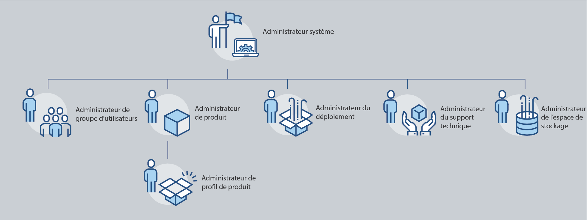
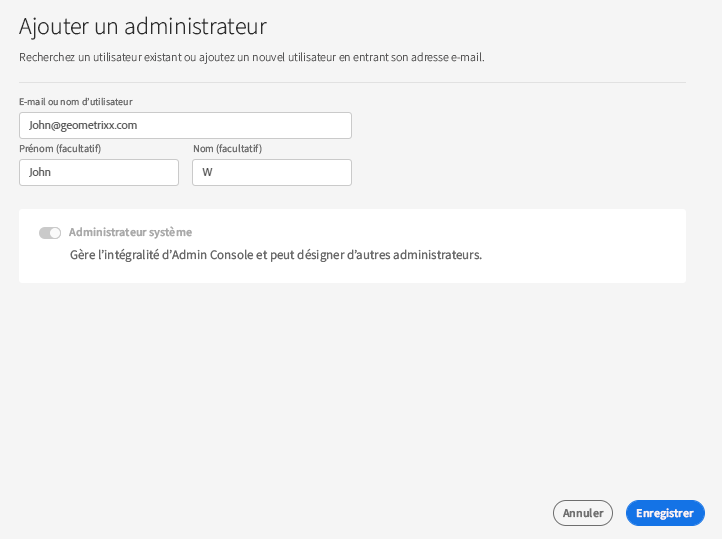
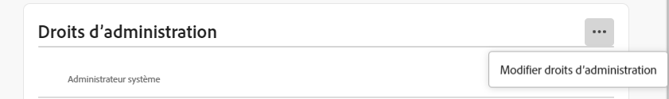

# Rôles administratifs

Avec Adobe Admin Console, les entreprises peuvent définir une hiérarchie administrative flexible qui permet une gestion affinée de l’accès et de l’utilisation des produits Adobe. Un ou plusieurs administrateurs système, configurés pendant le processus d’intégration d’entreprise, se trouvent en haut de la hiérarchie. Ces administrateurs système peuvent déléguer des responsabilités à d’autres administrateurs tout en conservant un contrôle global.

Les rôles administratifs offrent aux entreprises les principaux avantages suivants :

* Délégation contrôlée des responsabilités administratives
* Aperçu rapide des affectations de produits (par utilisateur et par produit)
* Fonctionnalité d’affectation de quotas aux administrateurs de produit

## Arborescence administrative

S’applique aux clients Adobe Grands comptes.

La hiérarchie administrative peut être utilisée en fonction des besoins uniques de votre entreprise. Par exemple, une entreprise peut nommer différents administrateurs pour gérer les droits aux offres Adobe Creative Cloud et Adobe Marketing Cloud. Une entreprise peut également avoir différents administrateurs pour gérer les droits des utilisateurs appartenant à différentes unités opérationnelles.

>[!NOTE]
>
>La hiérarchie administrative ne s’applique pas aux clients Équipe. Les clients Équipe ne disposent que d’un seul rôle **Administrateur système**. Le propriétaire du contrat (_précédemment appelé&#x200B;**Administrateur principal**_) est l’administrateur système qui a accès aux détails du contrat et à l’historique de facturation. Si vous êtes le propriétaire actuel du contrat, vous pouvez nommer un administrateur système existant (_ précédemment appelé **Administrateur secondaire**_) en tant que propriétaire du contrat.

_Hiérarchie des rôles d’administrateur_

| Rôle | Description |
|--- |--- |
| **Administrateur système** | Super utilisateur pour l’entreprise ; peut effectuer toutes les tâches administratives dans l’Admin Console. Dispose également des autorisations nécessaires pour déléguer les fonctionnalités d’administration suivantes à d’autres utilisateurs : administrateur de produit, administrateur de profil de produit, administrateur de groupe d’utilisateurs, administrateur de déploiement et administrateur de support. |
| **Administrateur de produit** | Gère les produits qui lui sont affectés et toutes les fonctions administratives associées, notamment les suivantes :<ul><li>La création de profils de produit</li><li>L’ajout d’utilisateurs et de groupes d’utilisateurs à l’organisation, mais non leur suppression</li><li>L’ajout ou la suppression d’utilisateurs et de groupes d’utilisateurs dans des profils de produit</li><li>L’ajout ou la suppression d’administrateurs de profil de produit dans des profils de produit</li><li>L’ajouter ou la suppression d’autres administrateurs de produit dans le produit</li><li>L’ajouter ou la suppression d’administrateurs de groupe dans des groupes</li></ul> |
| **Administrateur de profil de produit** | Gère les descriptions des profils de produits qui lui sont affectés et toutes les fonctions administratives associées, notamment les suivantes :<ul><li>L’ajout d’utilisateurs et de groupes d’utilisateurs à l’organisation, mais non leur suppression</li><li>L’ajout ou la suppression d’utilisateurs et de groupes d’utilisateurs dans des profils de produit</li><li>L’attribution ou la révocation des autorisations de produit aux utilisateurs et aux groupes d’utilisateurs des profils de produit</li><li>La gestion des rôles de produit des utilisateurs et des groupes d’utilisateurs pour les profils de produit |
| **Administrateur des groupes d’utilisateurs** | Gère les descriptions des groupes d’utilisateurs qui lui sont affectés et toutes les fonctions administratives associées, notamment les suivantes :<ul><li>L’ajout ou la suppression d’utilisateurs dans des groupes</li><li>L’ajout ou la suppression d’administrateurs de groupe d’utilisateurs à partir de groupes |
| **Administrateur de déploiement** | Crée, gère et déploie des packages logiciels et des mises à jour pour les utilisateurs finaux. |
| **Administrateur de support** | Rôle non administratif ayant accès aux informations relatives au support, telles que les rapports concernant les problèmes signalés par les clients. |
| **Administrateur de stockage** | Gère l’administration du stockage de l’organisation. L’administrateur peut afficher la consommation du stockage des utilisateurs actifs et inactifs et transférer le contenu à d’autres destinataires. |

Pour obtenir une liste détaillée des autorisations et des privilèges pour chaque rôle d’administrateur, consultez les [Autorisations](#enterprise-admins-permissions-matrix).

## Ajout d’un rôle d’administrateur ou d’administratrice d’entreprise {#add-enterprise-role}

S’applique aux clients Adobe Grands comptes.

En tant qu’administrateur, vous pouvez affecter un rôle d’administrateur à d’autres utilisateurs et leur accorder les mêmes privilèges que vous, ou des privilèges pour un rôle inférieur à votre rôle d’administrateur dans la hiérarchie, comme décrit [ci-dessous](#administrative-hierarchy). Par exemple, en tant qu’administrateur de produit, vous pouvez accorder des privilèges d’administrateur de produit ou d’administrateur de profil de produit à un utilisateur, mais pas des privilèges d’administrateur de déploiement. Pour plus d’informations sur les autorisations dans l’Admin Console, consultez la section [Matrice des autorisations](#enterprise-admins-permissions-matrix).

Pour ajouter ou inviter un administrateur :

1. Dans l’[Admin Console](https://adminconsole.adobe.com/), choisissez **Utilisateurs** > **Administrateurs**.

   Vous pouvez également accéder au produit, au profil de produit ou au groupe d’utilisateurs approprié, puis à l’onglet **Admins**.

1. Cliquez sur **Ajouter un administrateur**.
1. Saisissez un nom ou une adresse électronique. Vous pouvez rechercher des utilisateurs existants ou ajouter un nouvel utilisateur en spécifiant une adresse électronique valide et en renseignant les informations à l’écran.
1. Cliquez sur **Suivant**. Une liste des rôles d’administrateur s’affiche.

>[!NOTE]
>
>* Les options de cet écran dépendent de votre compte et de votre rôle d’administrateur. Vous pouvez accorder les mêmes privilèges dont vous disposez, ou des privilèges liés à un rôle inférieur au vôtre dans la hiérarchie.
>* En tant qu’administrateur système d’une équipe, vous ne pouvez affecter qu’un seul rôle d’administrateur : administrateur système.

1. Sélectionnez un ou plusieurs rôles d’administrateur.
1. Pour les types d’administrateurs tels qu’Administrateur de produit, Administrateur de profil de produit et Administrateur de groupe d’utilisateurs, sélectionnez respectivement les produits, les profils et les groupes pour chacun de ces rôles.

>[!NOTE]
>
>Pour un administrateur de profil de produit, vous pouvez inclure des profils pour plusieurs produits.

1. Vérifiez les rôles d’administrateur attribués à l’utilisateur et cliquez sur **Enregistrer**.

L’utilisateur reçoit une invitation par e-mail concernant les nouveaux privilèges d’administrateur de `message@adobe.com`.

Les utilisateurs doivent cliquer sur **Commencer** dans l’e-mail pour rejoindre l’organisation. Si les nouveaux administrateurs n’utilisent pas le lien **Commencer** dans l’e-mail d’invitation, ils ne peuvent pas se connecter à l’Admin Console.

Dans le cadre du processus de connexion, les utilisateurs peuvent être invités à configurer un profil Adobe s’ils n’en ont pas déjà un. Si plusieurs profils sont associés à leur e-mail, les utilisateurs doivent choisir « Rejoindre l’équipe » (si vous y êtes invité), puis sélectionner le profil associé à la nouvelle organisation.

## Ajout d’un administrateur Équipe {#add-admin-teams}

S’applique aux clients Adobe Équipe.

En tant qu’administrateur, vous pouvez affecter le rôle d’administrateur système à d’autres utilisateurs et leur accorder les mêmes privilèges que vous.

Pour ajouter ou inviter un administrateur système :

1. Dans l’Admin Console, choisissez **Utilisateurs** > **Administrateurs**.

   Une liste des administrateurs existants s’affiche.

1. Cliquez sur **Ajouter un administrateur**.

   L’écran **Ajouter un administrateur** s’affiche.

1. Saisissez un nom ou une adresse électronique. Vous pouvez rechercher des utilisateurs existants ou ajouter un nouvel utilisateur en spécifiant une adresse électronique valide et en renseignant les informations à l’écran.

   Par défaut, l’administrateur système est sélectionné.

1. Cliquez sur **Enregistrer**.

Comme tous les utilisateurs d’une organisation de type Équipe sont des utilisateurs disposant d’un ID professionnel, ils reçoivent une invitation par e-mail concernant les nouveaux privilèges d’administrateur de la part de `message@adobe.com`.
Les utilisateurs doivent cliquer sur Commencer dans l’e-mail pour rejoindre l’organisation.

Dans le cadre du processus de connexion, les utilisateurs peuvent être invités à configurer un profil Adobe s’ils n’en ont pas déjà un. Si plusieurs profils sont associés à leur e-mail, les utilisateurs doivent choisir « Rejoindre l’équipe » (si vous y êtes invité), puis sélectionner le profil associé à la nouvelle organisation.

## Modification du rôle d’administrateur Grands comptes

S’applique aux clients Adobe Grands comptes.

En tant qu’administrateur, vous pouvez modifier le rôle d’administrateur pour les autres administrateurs qui se trouvent en dessous de vous dans la hiérarchie d’administration. Par exemple, vous pouvez supprimer les privilèges d’autres administrateurs.

Pour modifier les rôles d’administrateur :

1. Dans l’Admin Console, choisissez **Utilisateurs** > **Administrateurs**. La liste des administrateurs existants s’affiche.

   Vous pouvez également accéder au produit, au profil de produit ou au groupe d’utilisateurs approprié, puis à l’onglet **Admins**.

1. Cliquez sur le nom de l’administrateur à modifier.
1. Dans les **Informations de l’utilisateur**, cliquez sur l’ des **Droits d’administrateur** et choisissez **Modifier les droits d’administrateur**.

   

1. Modifiez les droits d’administrateur et enregistrez vos modifications.

## Modifier le rôle d’administrateur Équipe

S’applique aux clients Adobe Équipe.

En tant qu’administrateur système Équipe, vous pouvez supprimer les privilèges d’administrateur système des autres administrateurs.

Pour révoquer les privilèges d’administrateur système :

1. Dans l’Admin Console, choisissez **Utilisateurs** > **Administrateurs**.

   La liste des administrateurs existants s’affiche.

1. Dans les Informations de l’utilisateur, cliquez sur l’ à droite de la section **Droits d’administrateur** et choisissez **Modifier les droits d’administrateur**.

   

1. Modifiez les droits d’administrateur et enregistrez vos modifications.

## Suppression d’un administrateur

S’applique aux clients Adobe Équipe et Grands comptes.

1. Pour révoquer des autorisations d’administrateur, sélectionnez un utilisateur puis cliquez sur **Supprimer l’administrateur**.

>[!NOTE]
>
>La suppression d’un administrateur ne supprime pas l’utilisateur de l’Admin Console mais supprime uniquement les privilèges associés au rôle d’administrateur.

## Matrice des autorisations des administrateurs Grands comptes

S’applique aux clients Adobe Grands comptes.

Le tableau suivant répertorie toutes les autorisations pour les différents types d’administrateurs, classées selon les zones de fonctionnalités suivantes :

### Gestion des identités

| Autorisation | Administrateur système | Administrateur d’assistance |
|--- |--- |--- |
| Ajouter un domaine (demander/déposer un domaine) | ✔ | |
| Afficher des domaines et des listes de domaines | ✔ | |
| Gérer des clés de chiffrement de domaine | ✔ | |
| Gérer la stratégie de mot de passe par défaut de l’organisation | ✔ | |
| Afficher la stratégie de mot de passe par défaut de l’organisation | ✔ | |

### Gestion des utilisateurs

| Autorisation | Administrateur système | Administrateur d’assistance |
|--- |--- |--- |
| Ajouter un utilisateur à l’organisation | ✔ | |
| Supprimer un utilisateur de l’organisation | ✔ | |
| Afficher les informations et la liste des utilisateurs | ✔ | |
| Modifier le profil utilisateur | ✔ | |
| Ajouter un profil de produit à un utilisateur ou à un groupe | ✔ | |
| Supprimer un profil de produit pour un utilisateur ou un groupe | ✔ | |
| Ajouter un profil de produit à plusieurs utilisateurs | ✔ | |
| Afficher des profils de produit pour un utilisateur | ✔ | |
| Afficher la liste des utilisateurs de produits | ✔ | |
| Ajouter en masse des utilisateurs à l’organisation | ✔ | |

### Gestion des administrateurs

| Autorisation | Administrateur système | Administrateur d’assistance |
|--- |--- |--- |
| Attribuer les droits administrateur d’organisation à un utilisateur | ✔ | |
| Révoquer les droits administrateur d’organisation d’un utilisateur | ✔ | |
| Attribuer les droits administrateur de licence produit à un utilisateur | ✔ | |
| Révoquer les droits administrateur de licence produit d’un utilisateur | ✔ | |
| Attribuer les droits administrateur de déploiement à un utilisateur | ✔ | |
| Révoquer les droits administrateur de déploiement d’un utilisateur | ✔ | |
| Attribuer les droits administrateur de groupe d’utilisateurs à un utilisateur | ✔ | |
| Révoquer les droits administrateur de groupe d’utilisateurs d’un utilisateur | ✔ | |
| Attribuer les droits administrateur de propriété produit à un utilisateur | ✔ | |
| Révoquer les droits administrateur de propriété produit d’un utilisateur | ✔ | |

### Gestion de la configuration des licences de produit

| Autorisation | Administrateur système | Administrateur d’assistance |
|--- |--- |--- |
| Accorder des droits de produit à l’organisation | | |
| Supprimer des droits de produit de l’organisation | | |
| Afficher le nombre total de licences détenues par l’organisation | ✔ | |
| Afficher les produits et les familles de produits disponibles | ✔ | |
| Modifier les descriptions/données de licence produit | ✔ | |
| Octroi d’une licence produit à un utilisateur | ✔ | |
| Suppression d’une licence produit d’un utilisateur | ✔ | |
| Ajouter une nouvelle configuration de licence produit | ✔ | |
| Modifier la configuration du service de licence produit | ✔ | |
| Supprimer la configuration du service de licence produit | ✔ | |
| Supprimer l’accès d’un utilisateur à des produits (suppression de toutes les configurations) | ✔ | |

### Gestion du stockage

| Autorisation | Administrateur système | Administrateur d’assistance |
|--- |--- |--- |
| Afficher les dossiers d’utilisateurs actifs et inactifs | ✔ | |
| Supprimer les dossiers d’utilisateurs inactifs et transférer le contenu concerné | ✔ | |

### Déploiement

| Autorisation | Administrateur système | Administrateur d’assistance |
|--- |--- |--- |
| Afficher/utiliser l’onglet Packages | ✔ | |

### Assistance

| Autorisation | Administrateur système | Administrateur d’assistance |
|--- |--- |--- |
| Afficher l’onglet Assistance | ✔ | |
| Gestion des cas d’assistance | ✔ | ✔ |

### Gestion des groupes d’utilisateurs

| Autorisation | Administrateur système | Administrateur d’assistance |
|--- |--- |--- |
| Créer un groupe d’utilisateurs | ✔ | |
| Supprimer un groupe d’utilisateurs | ✔ | |
| Ajouter un utilisateur à un groupe d’utilisateurs | ✔ | |
| Supprimer un utilisateur d’un groupe d’utilisateurs | ✔ | |
| Attribuer un groupe d’utilisateurs à une licence produit | ✔ | |
| Supprimer un groupe d’utilisateurs d’une licence produit | ✔ | |
| Afficher un membre d’un groupe d’utilisateurs | ✔ | ✔ |
| Afficher la liste des groupes d’utilisateurs | ✔ | ✔ |
