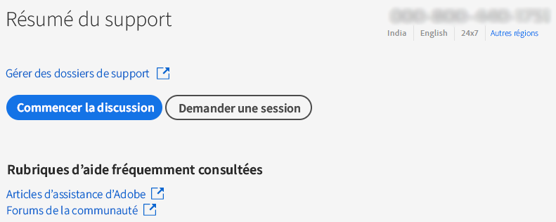
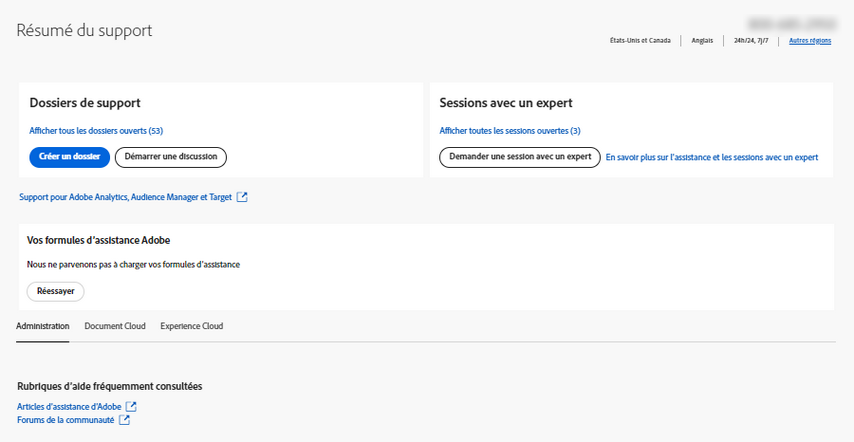

# Grands comptes et Équipe | Contacter l’assistance clientèle Adobe

Pour contacter l’assistance clientèle d’Adobe, accédez à l’onglet **Assistance** dans l’[Admin Console](https://adminconsole.adobe.com/).

L’**Onglet Assistance** dans l’[Admin Console](https://adminconsole.adobe.com/) vous permet d’accéder à diverses options d’assistance par le biais d’une interface simple et conviviale. Les options disponibles dans l’onglet Assistance dépendent de votre formule d’abonnement. Pour plus d’informations, cliquez sur **En savoir plus** en fonction de votre formule d’abonnement.

Si vous n’êtes pas sûr de savoir quelle est votre formule d’abonnement, accédez à l’**Onglet Assistance** sur l’[Admin Console](https://adminconsole.adobe.com/) et comparez ce que vous voyez aux images ci-dessous. Cliquez ensuite sur le lien **En savoir plus** correspondant.

## Pour les comptes Équipe

<!--
[Learn more](https://helpx.adobe.com/enterprise/using/support-for-teams.html)
-->

## Pour les comptes Grands comptes

<!--
[Learn more](https://helpx.adobe.com/enterprise/using/support-for-enterprise.html)
-->

## Pour Experience Cloud

<!--
[Learn more](https://www.adobe.com/go/ac_ec_not_supported_en)
-->
