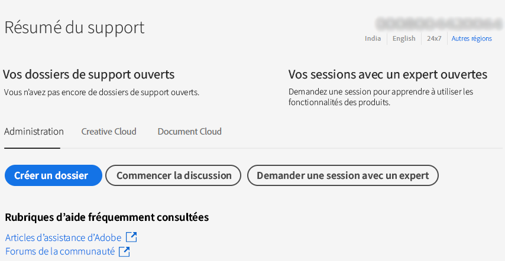

# Enterprise et équipes | Contacter l’assistance clientèle d’Adobe

Pour contacter l’assistance clientèle d’Adobe, accédez à la **Assistance** dans le [Admin Console](https://adminconsole.adobe.com/).

Le **Onglet Assistance** dans le [Admin Console](https://adminconsole.adobe.com/) vous permet d’accéder à diverses options d’assistance par le biais d’une interface simple et conviviale. Les options disponibles dans l’onglet Assistance dépendent de votre plan d’abonnement. Pour plus d’informations, cliquez sur **En savoir plus** correspondant à votre abonnement.

Si vous n’êtes pas sûr de votre plan d’abonnement, accédez à la **Onglet Assistance** sur le [Admin Console](https://adminconsole.adobe.com/)et comparez votre vue aux images ci-dessous. Cliquez ensuite sur la **En savoir plus** lien.

## Compte d’équipes

[En savoir plus](https://helpx.adobe.com/enterprise/using/support-for-teams.html)

## Compte d’entreprise

[En savoir plus](https://helpx.adobe.com/enterprise/using/support-for-enterprise.html)

## Pour Experience Cloud

[En savoir plus](https://www.adobe.com/go/ac_ec_not_supported_en)
