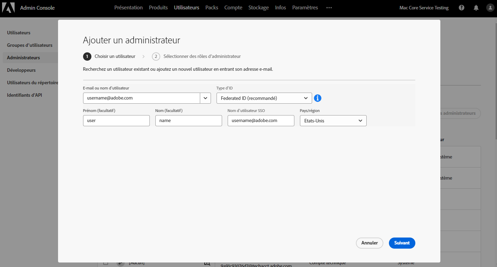
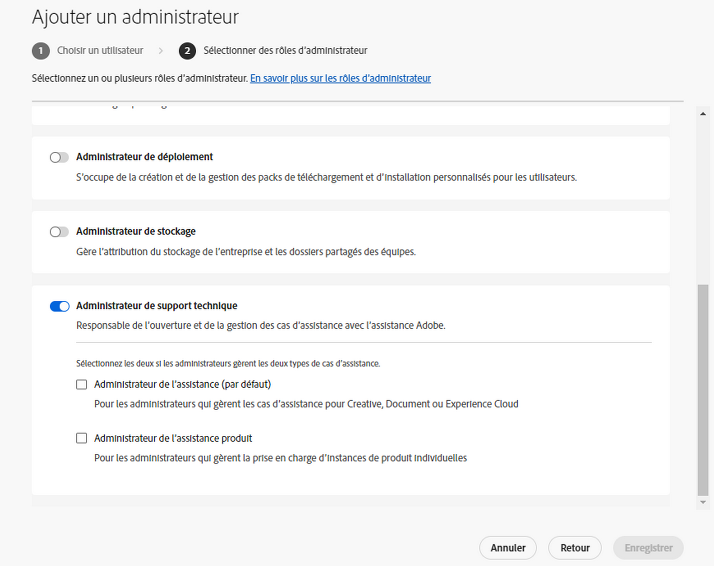
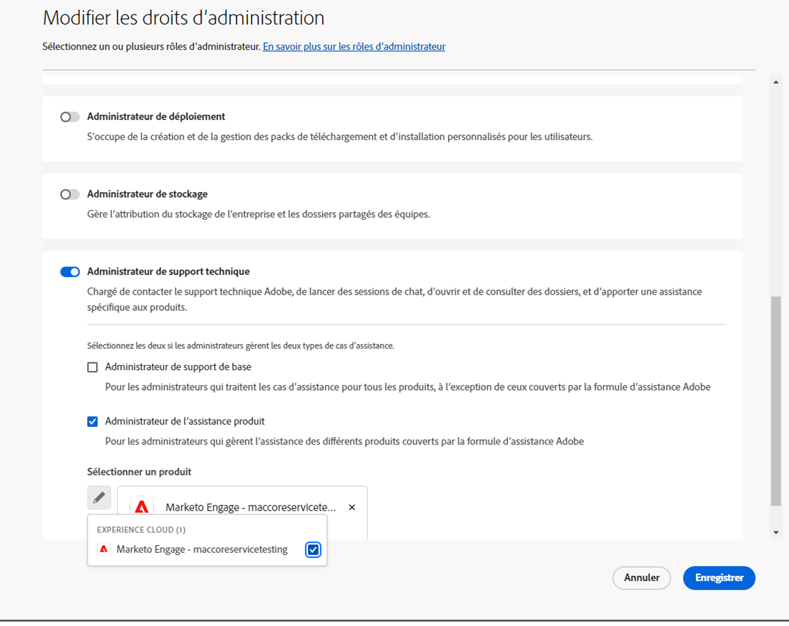
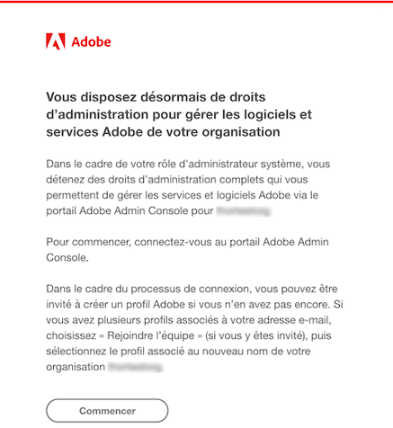
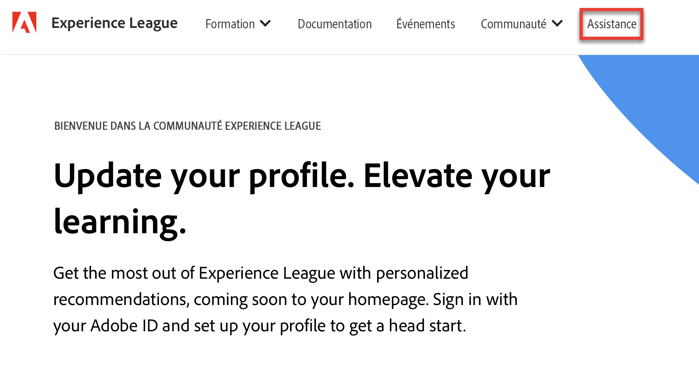
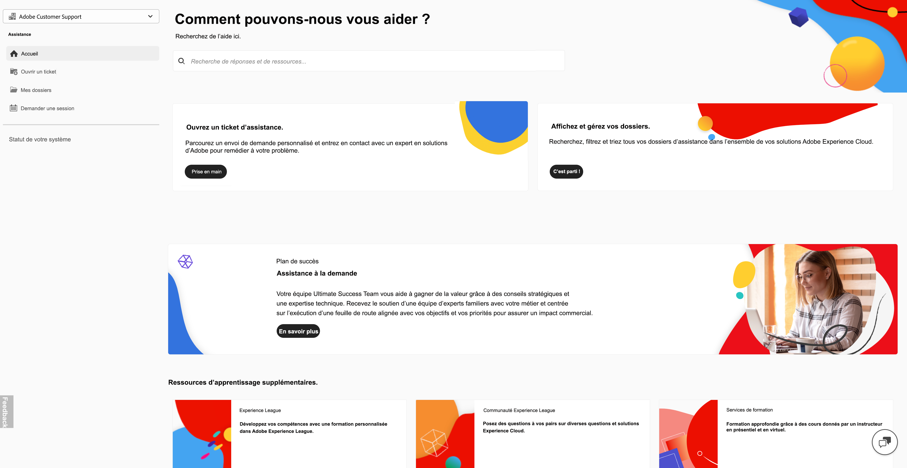
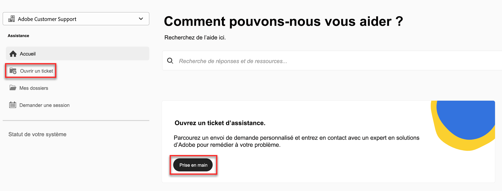
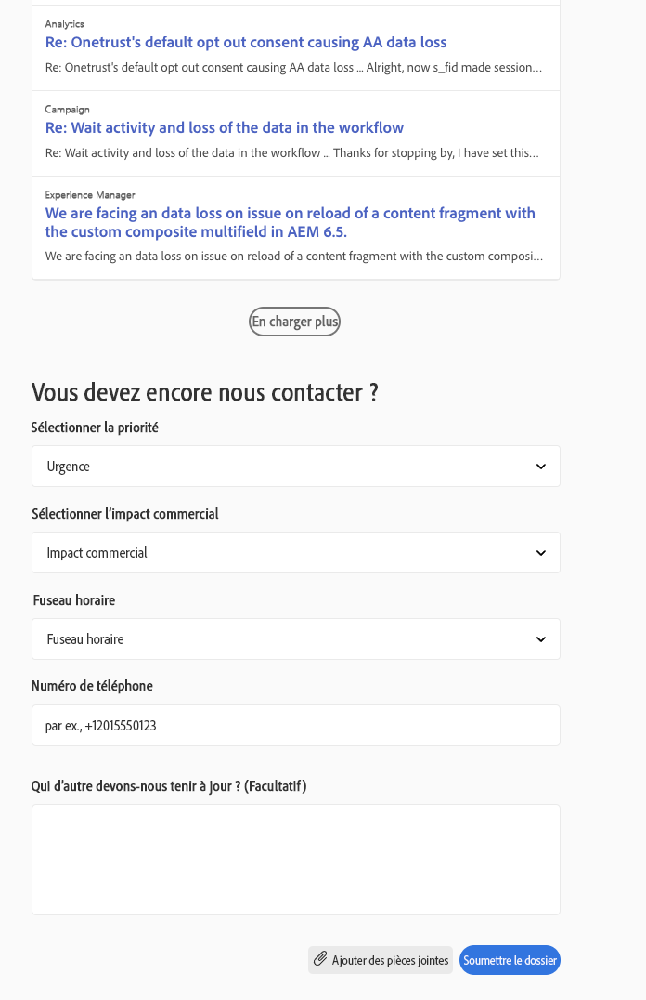

# Expérience du service clientèle d’Adobe

## Tickets d’assistance Experience League

Les tickets d’assistance sont maintenant envoyés via [Experience League](https://experienceleague.adobe.com/home#support). Pour obtenir des instructions sur la manière d’envoyer un ticket d’assistance, consultez la section [Envoi d’un ticket d’assistance](#submit-ticket).

Nous nous efforçons d’améliorer votre interaction avec le service clientèle d’Adobe. Notre objectif est de simplifier l’assistance en migrant vers un point d’accès unique, en utilisant Experience League. Une fois ce service activé, votre entreprise pourra accéder facilement au service clientèle Adobe, bénéficier d’une meilleure visibilité de l’historique de vos services grâce à un système unifié pour tous les produits, et demander de l’aide par téléphone, sur le Web ou par chat par le biais d’un portail unique.

Si vous utilisez Adobe Commerce, reportez-vous à la section [Envoyer un dossier d’assistance](https://experienceleague.adobe.com/fr/docs/commerce-knowledge-base/kb/help-center-guide/magento-help-center-user-guide#support-case) dans le Guide de l’utilisateur de l’assistance Experience League pour Adobe Commerce.

## Prise en charge des rôles autorisés nécessaires pour l’envoi de dossiers {#submit-ticket}

Pour envoyer un ticket d’assistance dans [Experience League](https://experienceleague.adobe.com/home#support), vous devez disposer du rôle Administrateur d’assistance attribué par un membre de l’administration système. Seul un administrateur système de votre entreprise peut affecter ce rôle. Les rôles d’administrateur de produit et de profil de produit et les autres rôles d’administration ne peuvent pas affecter le rôle d’administrateur d’assistance et ne peuvent pas afficher l’option **[!UICONTROL Créer un dossier]** utilisée pour envoyer un ticket d’assistance. Pour en savoir plus sur les différents types de rôles d’administration et les droits associés, reportez-vous à la section [Rôles d’administration](admin-roles.md).

Si vous utilisez Commerce, la procédure de partage de l’accès pour le traitement des dossiers d’assistance est différente. Pour en savoir plus, reportez-vous à la section [Accès partagé : accorder des privilèges pour permettre à d’autres personnes d’accéder à votre compte](https://experienceleague.adobe.com/fr/docs/commerce-knowledge-base/kb/help-center-guide/magento-help-center-user-guide#shared-access) dans le guide de l’utilisateur de l’assistance Experience League pour Adobe Commerce.

### Ajout de rôles d’autorisation d’assistance à une organisation

Le rôle d’administrateur d’assistance est un rôle non administratif qui permet d’accéder aux informations relatives à l’assistance. Les administrateurs d’assistance peuvent afficher, créer et gérer des rapports sur des problèmes.

Pour ajouter ou inviter un administrateur :

1. Dans l’Admin Console, choisissez **[!UICONTROL Utilisateurs]** > **[!UICONTROL Administrateurs]**.
1. Cliquez sur **[!UICONTROL Ajouter un administrateur]**.
1. Saisissez un nom ou une adresse électronique.

   Vous pouvez rechercher des utilisateurs existants ou ajouter un nouvel utilisateur en spécifiant une adresse e-mail valide et en renseignant les informations à l’écran.

   

1. Cliquez sur **[!UICONTROL Suivant]**. Une liste des rôles d’administrateur s’affiche.

Pour attribuer un rôle d’administrateur d’assistance à un utilisateur (permettre à un utilisateur de contacter le service d’assistance), procédez comme suit :

1. Sélectionnez l’option **[!UICONTROL Administrateur d’assistance]**.

   

1. Sélectionnez l’une des deux options suivantes :

   * Option 1 : **[!UICONTROL Administrateur d’assistance de base]**. Sélectionnez cette option si vous souhaitez donner à l’utilisateur l’accès à l’assistance pour toutes les solutions (à l’exception de Marketo Engage).
   * Option 2 : **[!UICONTROL Administrateur d’assistance produit]** : sélectionnez cette option pour la prise en charge de Marketo Engage. Sélectionnez les instances Marketo Engage auxquelles accorder l’accès à l’assistance utilisateur.

   

1. Une fois les sélections effectuées, cliquez sur **[!UICONTROL Enregistrer]**.

L’utilisateur reçoit une invitation par e-mail concernant les nouveaux privilèges d’administrateur de `message@adobe.com`.

Les utilisateurs doivent cliquer sur **Commencer** dans l’e-mail pour rejoindre l’organisation. Si les nouveaux administrateurs n’utilisent pas le lien **Commencer** dans l’e-mail d’invitation, ils ne peuvent pas se connecter à l’Admin Console.

Dans le cadre du processus de connexion, les utilisateurs peuvent être invités à configurer un profil Adobe s’ils n’en ont pas déjà un. Si plusieurs profils sont associés à leur adresse e-mail, les utilisateurs doivent choisir **Rejoindre l’équipe** (s’ils y sont invités), puis sélectionner le profil associé à la nouvelle organisation.

Pour plus d’informations, suivez les instructions relatives à la [modification du rôle d’administrateur d’entreprise](admin-roles.md#add-enterprise-role) dans la documentation sur les rôles d’administration. Notez que seul un administrateur système de votre entreprise peut affecter ce rôle. Pour plus d’informations sur la hiérarchie administrative, consultez la documentation sur les [rôles administratifs](admin-roles.md).

### Création d’un ticket d’assistance avec Experience League

Désormais, le processus d’envoi de dossiers d’assistance est directement intégré à la plateforme d’assistance d’Experience League. Il s’agit d’un portail en libre-service qui a fait récemment l’objet d’une refonte complète afin d’offrir plus d’options de personnalisation et une utilisation plus facile aux personnes autorisées.

1. Pour créer un ticket à l’aide d’[Experience League](https://experienceleague.adobe.com/home#support), sélectionnez l’onglet **[!UICONTROL Assistance]** dans le volet de navigation supérieur.
   
1. Sur la page d’accueil de l’assistance, vous pouvez facilement accéder à vos dossiers d’assistance ouverts, enregistrer un nouveau dossier, afficher les principaux articles de l’assistance ou encore accéder à des sources d’apprentissage supplémentaires.
   
1. Pour envoyer un dossier, sélectionnez **[!UICONTROL Ouvrir un ticket d’assistance]**. Sélectionnez également l’option **[!UICONTROL Ouvrir un ticket]** dans le menu de la barre latérale. Vous accédez alors à la page de création d’un dossier, où vous pouvez saisir le nom de votre produit (Audience Manager, Campaign, Target, etc.), le titre du dossier ainsi que sa description. Pour accélérer le processus de résolution des problèmes, décrivez aussi précisément que possible le problème que vous rencontrez.
   
1. À la fin du formulaire, renseignez les champs suivants. Lorsque vous sélectionnez une solution, les informations suivantes vous sont demandées, et certaines solutions comportent des champs supplémentaires :

   * Priorité des dossiers (Faible, Moyenne, Élevée, Critique)
   * Impact commercial
   * Fuseau horaire du client (Amériques, EMEA, APAC)

>[!TIP]
>
> Si vous ne parvenez pas à voir l’option **[!UICONTROL Créer un dossier]** ou l’onglet **[!UICONTROL Support technique]**, contactez une personne en charge de l’administration système pour obtenir le rôle Administrateur d’assistance.

>[!NOTE]
>
> Si le problème cause des pannes ou de graves interruptions de service d’un système de production, un numéro de téléphone vous est fourni pour obtenir une assistance immédiate.

<!--

## What About the Legacy Systems?

New Tickets/Cases will no longer be able to be submitted in legacy systems as of May 11th.  The [Admin Console](https://adminconsole.adobe.com/) will be used to submit new tickets/cases.

### Existing Tickets/Cases

* Between May 11th and May 20th the legacy systems will remain available to work existing tickets/cases to completion.
* Beginning May 20th the support team will migrate remaining open cases from the legacy systems to the new support experience.  You will receive an email notification regarding how to contact support to continue to work these cases.
-->
