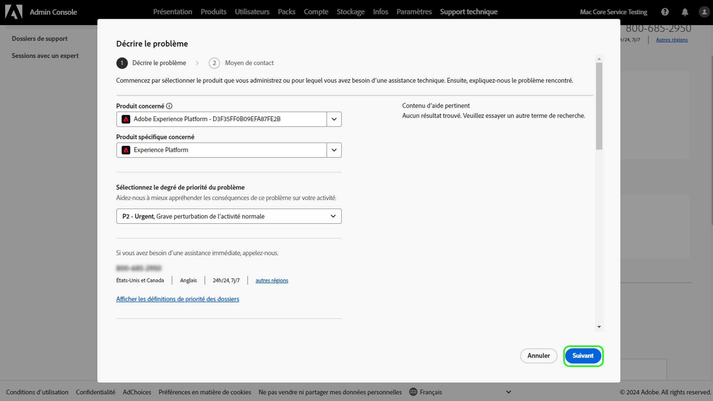

# Expérience du service clientèle d’Adobe

## Tickets d’assistance pour les Admin Console

Les tickets d’assistance peuvent désormais être envoyés via le [Admin Console](https://adminconsole.adobe.com/). Pour obtenir des instructions sur la manière d’envoyer un ticket d’assistance, consultez la section pour [envoi d’un ticket d’assistance](#submit-ticket).

Nous nous efforçons d’améliorer votre interaction avec le service clientèle d’Adobe. Notre vision consiste à simplifier l’expérience du service clientèle en passant à un point d’entrée unique, à l’aide de Adobe Admin Console. Une fois en ligne, votre entreprise pourra facilement accéder au service clientèle d’Adobe ; bénéficier d’une meilleure visibilité de votre historique de services par le biais d’un système commun à tous les produits ; et demander de l’aide par téléphone, sur le web et par le biais d’un portail unique.

## Besoin d’aide avec la nouvelle plateforme d’assistance ?

Nous proposons une série de réunions en ligne où les clients peuvent poser leurs questions sur le nouveau processus d’assistance. Sélectionnez une ou plusieurs personnes à rejoindre :

| Date et heure | Lien d’enregistrement |
|--- |--- |
| Jeudi 7 avril à 8h00 PT | [Lien d’événement](https://event.on24.com/wcc/r/3723732/5288A3B031AD858BF241EB0C0057CD85) |
| Jeudi 7 avril à 17h00, heure du Pacifique | [Lien d’événement](https://event.on24.com/wcc/r/3723733/286EFEA9E8D9B6BB49464862F5414B8C) |
| Mercredi 20 avril à 8h00 PT | [Lien d’événement](https://event.on24.com/wcc/r/3712143/05DAF046E4BB864E7C313B056ADE4EB2) |
| Mercredi 20 avril à 17hPT | [Lien d’événement](https://event.on24.com/wcc/r/3723740/A9EDA45FA61D3FFC4BF713419B677F16) |
| Jeudi 21 avril à 8h00 PT | [Lien d’événement](https://event.on24.com/wcc/r/3723741/C7EBCD38583D4D7AFCBD56029EB17C98) |
| Jeudi 21 avril à 17hPT | [Lien d’événement](https://event.on24.com/wcc/r/3723743/6F41ED2648A621F1419A56F0A52F4446) |

{style=&quot;table-layout:auto&quot;}

## Comment envoyer un ticket d’assistance Admin Console {#submit-ticket}

Pour envoyer un ticket d’assistance dans [Admin Console](https://adminconsole.adobe.com/), vous devez avoir le rôle d’administrateur du support attribué par un administrateur système. Seul un administrateur système de votre entreprise peut affecter ce rôle. Les rôles d’administrateur de produit, de produit et autres rôles d’administration ne peuvent pas affecter le rôle d’administrateur du support et ne peuvent pas afficher le **[!UICONTROL Créer un cas]** option utilisée pour envoyer un ticket d’assistance. Pour plus d’informations, consultez la [Assistance clientèle entreprise et équipes](customer-care.md) documentation.

### Attribution du rôle d’administrateur du support

Le rôle d’administrateur de l’assistance est un rôle non administratif qui a accès aux informations relatives à l’assistance. Les administrateurs de l’assistance peuvent afficher, créer et gérer des rapports de problèmes.

Pour attribuer un rôle d’administrateur au service clientèle, suivez le [modifier le rôle d’administrateur d’entreprise](admin-roles.md#add-admin-teams) instructions dans la documentation sur les rôles d’administration. Notez que seul un administrateur système de votre entreprise peut affecter ce rôle. Pour plus d’informations sur la hiérarchie administrative, consultez la section [rôles administratifs](admin-roles.md) documentation.

### Créer un ticket d’assistance avec un Admin Console

Pour créer un ticket à l’aide de [Admin Console](https://adminconsole.adobe.com/), sélectionnez la variable **[!UICONTROL Assistance]** dans le volet de navigation supérieur. Le [!UICONTROL Résumé de l’assistance] s’affiche. Sélectionnez ensuite le **[!UICONTROL Créer un cas]** .

>[!TIP]
>
> Si vous ne parvenez pas à voir la variable **[!UICONTROL Créer un cas]** ou l’option **[!UICONTROL Assistance]** , vous devez contacter un administrateur système pour affecter le rôle d’administrateur du support.

Une boîte de dialogue s’affiche, vous permettant de sélectionner un type de problème. Sélectionnez le type de problème qui décrit le mieux votre problème ou votre question, puis sélectionnez **[!UICONTROL Créer un cas]** en bas à droite.

Le **[!UICONTROL Créer un cas]** s’affiche. Vous êtes invité à fournir des informations telles que le produit, la priorité, la description et à joindre des captures d’écran pour vous aider à décrire le problème. Sélectionner **[!UICONTROL Suivant]** pour continuer.

>[!NOTE]
>
> Si le problème entraîne des pannes ou des interruptions extrêmement graves d’un système de production, un numéro de téléphone est fourni pour une assistance immédiate.

La page suivante vous permet de renseigner les coordonnées et de fournir le meilleur moment pour que le service clientèle d’Adobe vous contacte. Une fois l’opération terminée, sélectionnez **[!UICONTROL Envoyer]** en bas à droite et votre ticket est envoyé au service clientèle d’Adobe.

<!--

## What About the Legacy Systems?

New Tickets/Cases will no longer be able to be submitted in legacy systems as of May 11th.  The [Admin Console](https://adminconsole.adobe.com/) will be used to submit new tickets/cases.

### Existing Tickets/Cases

* Between May 11th and May 20th the legacy systems will remain available to work existing tickets/cases to completion.
* Beginning May 20th the support team will migrate remaining open cases from the legacy systems to the new support experience.  You will receive an email notification regarding how to contact support to continue to work these cases.
-->
