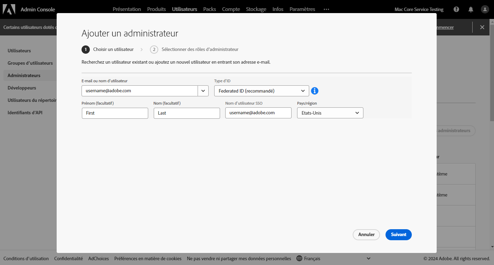
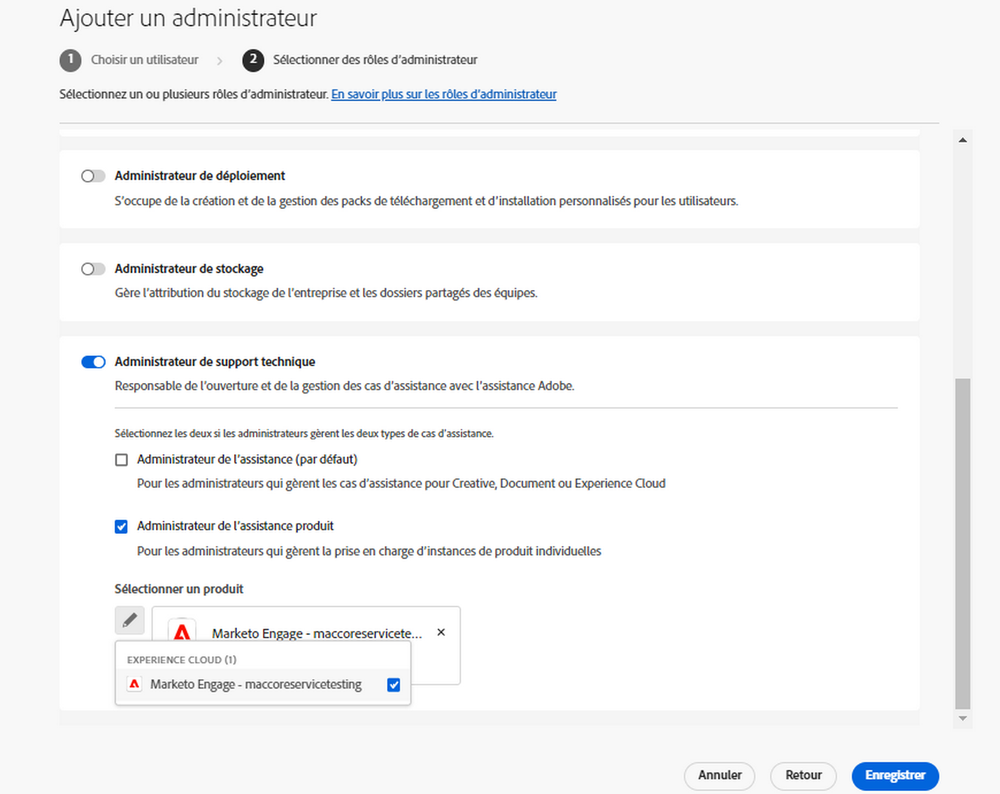

# Expérience du service clientèle d’Adobe

## Tickets d’assistance clientèle dans Admin Console

Les tickets du service clientèle peuvent désormais être envoyés par le biais du portail [Admin Console](https://adminconsole.adobe.com/). Pour obtenir des instructions sur la manière d’envoyer un ticket d’assistance, consultez la section [envoi d’un ticket d’assistance](#submit-ticket).

Nous nous efforçons d’améliorer votre interaction avec le service clientèle d’Adobe. Nous voulons simplifier notre système d’assistance grâce à un point d’accès unique, le portail Adobe Admin Console. Votre entreprise pourra alors facilement accéder au service clientèle Adobe, bénéficier de la visibilité offerte par l’historique de ses services via un portail d’entrée commun et demander de l’aide par téléphone, sur le web ou le chat par le biais d’un portail unique.

## Comment envoyer un ticket d’assistance Admin Console {#submit-ticket}

Pour envoyer un ticket d’assistance dans l’[Admin Console](https://adminconsole.adobe.com/), vous devez disposer du rôle d’administrateur d’assistance attribué par un administrateur système. Seul un administrateur système de votre entreprise peut affecter ce rôle. Les rôles d’administrateur de produit et de profil de produit et les autres rôles d’administration ne peuvent pas affecter le rôle d’administrateur d’assistance et ne peuvent pas afficher l’option **[!UICONTROL Créer un dossier]** utilisée pour envoyer un ticket d’assistance. Pour plus d’informations, consultez la documentation [Assistance clientèle Grands comptes et Équipe](customer-care.md).

### Attribution du rôle d’administrateur d’assistance

Le rôle d’administrateur d’assistance est un rôle non administratif qui permet d’accéder aux informations relatives à l’assistance. Les administrateurs d’assistance peuvent afficher, créer et gérer des rapports sur des problèmes.

Pour ajouter ou inviter un administrateur :

1. Dans l’Admin Console, choisissez **[!UICONTROL Utilisateurs]** > **[!UICONTROL Administrateurs]**.
1. Cliquez sur **[!UICONTROL Ajouter un administrateur]**.
1. Saisissez un nom ou une adresse électronique.

   Vous pouvez rechercher des utilisateurs existants ou ajouter un nouvel utilisateur en spécifiant une adresse électronique valide et en renseignant les informations à l’écran.

   

1. Cliquez sur **[!UICONTROL Suivant]**. Une liste des rôles d’administrateur s’affiche.

Pour attribuer un rôle d’administrateur au service clientèle à un utilisateur (permettre à un utilisateur de contacter le service d’assistance) :

1. Sélectionnez la variable **[!UICONTROL Administrateur de support]** .

   

1. Sélectionnez l’une des deux options suivantes :

   * Option 1 : **[!UICONTROL Administrateur de support de base]**. Sélectionnez cette option si vous souhaitez donner à l’utilisateur l’accès à l’assistance pour toutes les solutions (à l’exception de Marketo).
   * Option 2 : **[!UICONTROL Administrateur de support produit]**: sélectionnez cette option pour la prise en charge de Marketo. Sélectionnez les instances Marketo auxquelles accorder l’accès à l’assistance utilisateur.

   

1. Une fois les sélections effectuées, cliquez sur **[!UICONTROL Enregistrer]**.

L’utilisateur reçoit une invitation par e-mail concernant les nouveaux privilèges d’administrateur de `message@adobe.com`.

Les utilisateurs doivent cliquer sur **Commencer** dans l’e-mail pour rejoindre l’organisation. Si les nouveaux administrateurs n’utilisent pas le lien **Commencer** dans l’e-mail d’invitation, ils ne peuvent pas se connecter à l’Admin Console.

Dans le cadre du processus de connexion, les utilisateurs peuvent être invités à configurer un profil Adobe s’ils n’en ont pas déjà un. Si plusieurs profils sont associés à leur adresse électronique, les utilisateurs doivent choisir **Rejoindre l’équipe** (si vous y êtes invité), puis sélectionnez le profil associé à la nouvelle organisation.

### Création d’un ticket d’assistance avec l’Admin Console

Pour créer un ticket à l’aide de l’[Admin Console](https://adminconsole.adobe.com/), sélectionnez l’onglet **[!UICONTROL Support technique]** dans le volet de navigation supérieur. La page [!UICONTROL Résumé de l’assistance] s’affiche. Sélectionnez ensuite l’option **[!UICONTROL Créer un dossier]**.

>[!TIP]
>
> Si vous ne parvenez pas à voir l’option **[!UICONTROL Créer un dossier]** ou l’onglet **[!UICONTROL Support technique]**, contactez un administrateur système pour obtenir le rôle d’administrateur d’assistance.

Une boîte de dialogue s’affiche, vous permettant de sélectionner un type de problème. Sélectionnez le type de problème qui décrit le mieux votre situation ou votre question, puis sélectionnez **[!UICONTROL Créer un dossier]** en bas à droite.

La boîte de dialogue **[!UICONTROL Créer un dossier]** s’affiche. Vous êtes invité à fournir des informations telles que le produit, la priorité et une description du problème, et à joindre des captures d’écran pour vous aider à décrire votre situation. Sélectionnez **[!UICONTROL Suivant]** pour continuer.

>[!NOTE]
>
> Si le problème cause des pannes ou des interruptions de service extrêmement graves d’un système de production, un numéro de téléphone vous est fourni pour obtenir une assistance immédiate.

La page suivante vous permet de renseigner vos coordonnées et de communiquez vos préférences concernant le moment auquel le service clientèle d’Adobe pourra vous contacter. Une fois l’opération terminée, sélectionnez **[!UICONTROL Envoyer]** en bas à droite et votre ticket est envoyé au service clientèle d’Adobe.

<!--

## What About the Legacy Systems?

New Tickets/Cases will no longer be able to be submitted in legacy systems as of May 11th.  The [Admin Console](https://adminconsole.adobe.com/) will be used to submit new tickets/cases.

### Existing Tickets/Cases

* Between May 11th and May 20th the legacy systems will remain available to work existing tickets/cases to completion.
* Beginning May 20th the support team will migrate remaining open cases from the legacy systems to the new support experience.  You will receive an email notification regarding how to contact support to continue to work these cases.
-->
