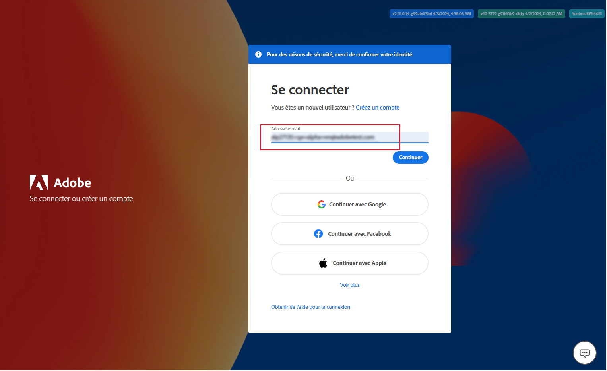
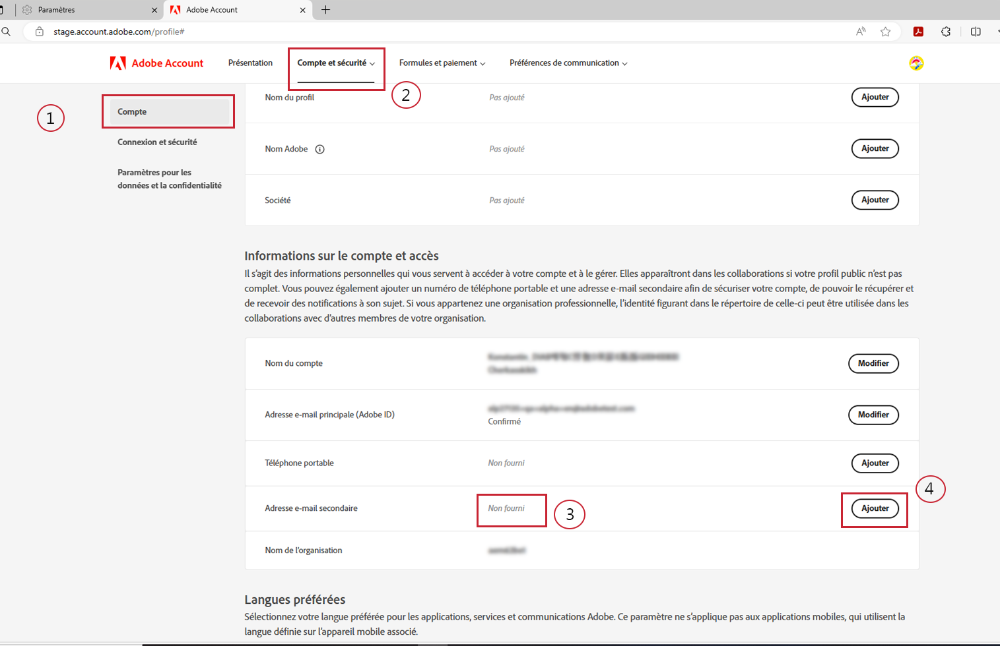
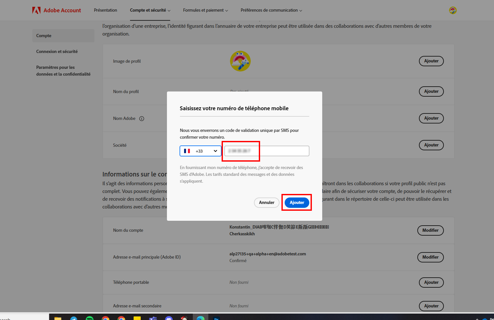
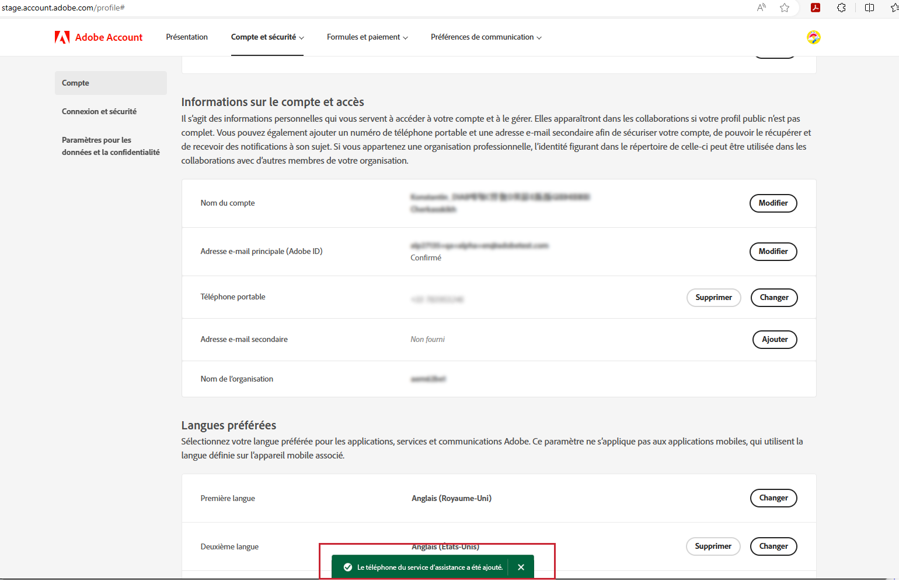

# Indiquer le numéro de téléphone d’assistance préféré

Lorsqu’un rôle « Admin » vous est attribué, tel que « Admin du support produit », vous devez normalement recevoir un e-mail vous informant que vous disposez des droits d’administration pour gérer l’instance pour laquelle ces droits vous ont été accordés.

L’e-mail contient désormais le texte en rouge ci-dessous, qui explique comment accéder au profil de votre compte et partager avec nous votre numéro de téléphone d’assistance préféré.

Pour indiquer votre numéro de téléphone préféré :

1. Cliquez sur le lien **Profil de compte** pour ouvrir une nouvelle fenêtre permettant de vous connecter à l’aide de `account.adobe.com`.

   

1. Suivez la procédure de connexion. Vous accédez alors à l’écran ci-dessous sur `account.adobe.com`.
1. Cliquez ensuite sur les onglets ci-dessous Compte et sécurité > Compte pour afficher le champ Numéro de téléphone d’assistance.
1. Ajoutez ici le numéro de téléphone que vous souhaitez que nous utilisions pour vous reconnaître lorsque vous avez besoin d’une assistance.

